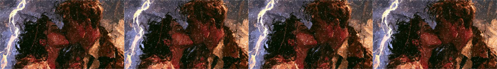
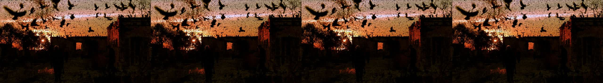

# MSCH Pointillism showcase

Examples supplied by Mario from the MSCH Node Showcase collection. The output files are preserved as supplied.

Thousands of colour-sampled dots re-scattered every frame over paper, with size variation, paper distortion, grain, ink bleed and a frame-hold stutter. Processing speed depends on the selected settings and hardware.

- kiss_storm_paper.mp4 - white paper, density 75, point_size 3.2, size_by_darkness 0.4
- birds_dawn_black.mp4 - black background, density 110, frame_drop 0.15 + hold_frames 3 for the stutter

## Gallery

Click a video preview to open its file on GitHub, or use the download link.

### Birds dawn black

[Open MP4](outputs/birds_dawn_black_00001_.mp4) · [Download original](https://github.com/mariobilly/msch-pointillism/raw/refs/heads/main/examples/showcase/outputs/birds_dawn_black_00001_.mp4)

### Kiss storm paper

[Open MP4](outputs/kiss_storm_paper_00001_.mp4) · [Download original](https://github.com/mariobilly/msch-pointillism/raw/refs/heads/main/examples/showcase/outputs/kiss_storm_paper_00001_.mp4)

## API workflows

These JSON files are ComfyUI API prompts, not canvas-format workflows. Send one as the `prompt` field of a `/prompt` request, or use a tool that accepts API workflows. A canvas importer may require conversion.

Choose your own source media and installed models before running. Source photos, video clips, audio and model weights are not bundled in this showcase. The supplied render settings and connections are retained; machine-specific absolute paths in the API copies use `INPUT_ROOT/` or `LOCAL_FILES/` placeholders. Replace these with paths valid on your computer.

- [pointillism_api.json](workflows_api/pointillism_api.json): `LoadImage`, `PointillismEffect`, `SaveVideo`.

### Input files and models

| Workflow | Node | Input | Source selection |
|---|---|---|---|
| `pointillism_api.json` | `1` | `image` | `msch_showcase/stills/kiss_storm.jpg` |
| `pointillism_api.json` | `4` | `image` | `msch_showcase/stills/birds_dawn.jpg` |

## Source notes

The collection notes identify images from the Jim Morrison image library, Mario’s clips, and the Suno track “Crushing Syncopation”. Those source assets are not included separately. The rendered media is supplied as showcase material; the repository’s MIT license describes the node code and does not establish a separate license for underlying media.
